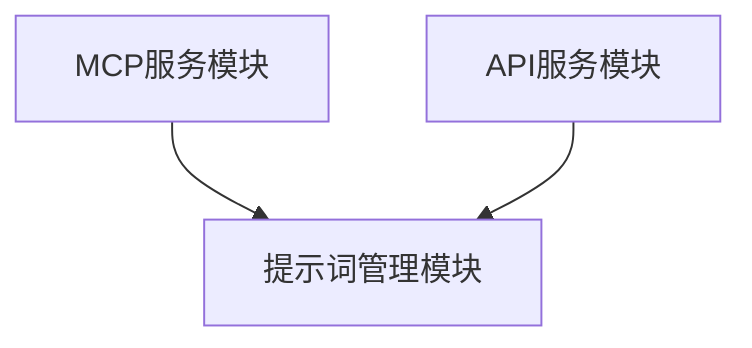
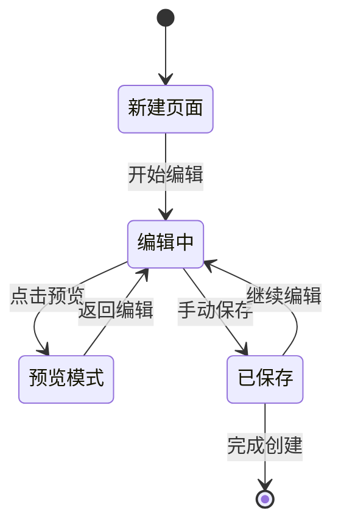
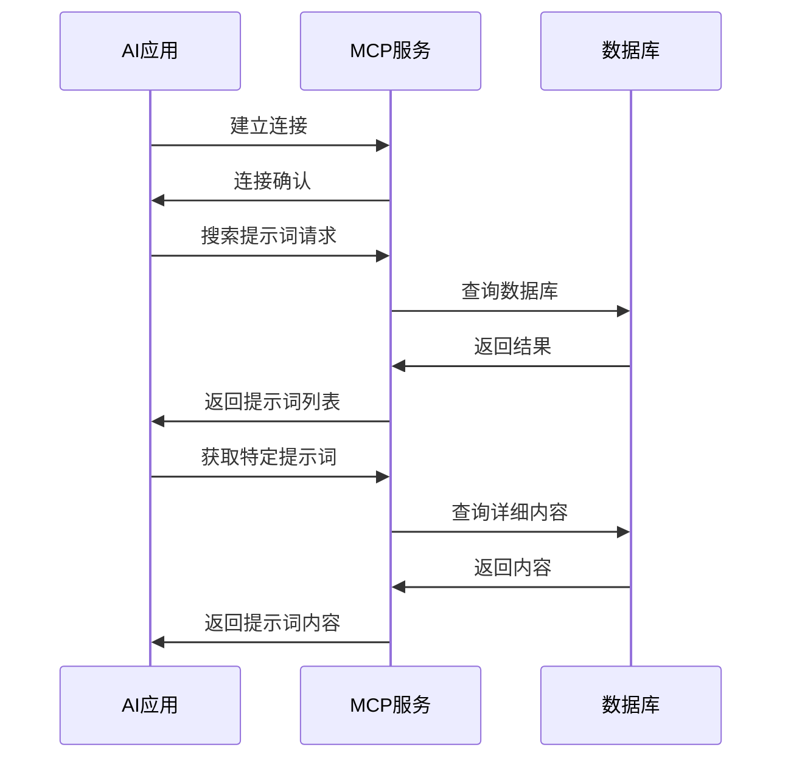
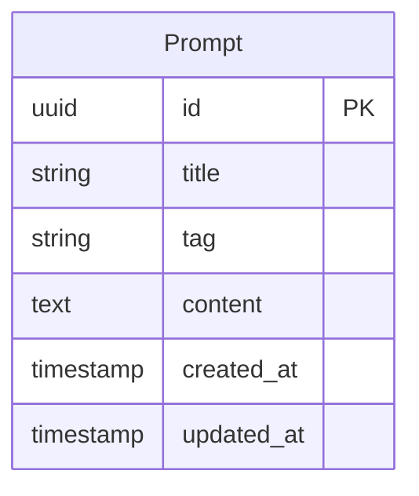

## AI提示词管理平台 - PromptHome

## 1. 产品概述

### 1.1 产品名称与定位

**产品名称**: PromptHome - AI提示词管理平台

**产品定位**: 面向AI工具使用者的专业提示词管理，通过标准化的MCP协议实现跨应用的提示词调用和管理。

### 1.2 目标平台列表

- **MacOS平台**: 原生 MacOS应用 (Swift 实现）
- **MCP服务**: 标准MCP协议服务端，支持多种AI应用。提供提示词列表查询和调用接口。

---

## 2. 产品功能需求

### 2.1 功能架构与模块划分

### 2.2 核心功能详述

### 2.2.1 提示词管理模块

**功能描述**:
作为AI工具使用者，我想要创建、编辑、组织和管理我的提示词，以便高效复用内容。

**用户价值**:
- 统一管理所有提示词，避免分散存储
- 支持富文本编辑，提升内容质量

**功能逻辑与规则**:
- 提示词基本属性: 标题、标签和内容
- 内容格式支持Markdown，包含语法高亮和预览
- 提示词字符数限制: 标题100字符，内容10000字符
- 支持使用 AI 大模型给提示词润色

**交互要求**:
- 提供所见即所得的Markdown编辑器
- 响应式设计，适配不同屏幕尺寸

**数据需求**:
- 提示词内容: 标题、正文、描述
- 标签信息: 用户自定义标签

**技术依赖**:
- Markdown解析和渲染库
- 存储数据库（**SwiftData**）

**验收标准**:
- 用户可以在30秒内创建一个新提示词
- Markdown渲染准确率100%
- 自动保存间隔不超过30秒
- 搜索响应时间 < 500ms

### 2.2.2 MCP服务模块

**功能描述**:
作为开发者，我想要通过标准MCP协议调用平台上的提示词，以便在任何支持MCP的AI应用中使用。

**用户价值**:
- 实现跨平台的提示词调用
- 标准化的接口，降低集成成本
- 实时同步，确保使用最新版本
- 支持批量调用，提升效率

**功能逻辑与规则**:
- 实现完整的MCP协议规范
- 提供提示词搜索、获取、调用接口
- 支持WebSocket长连接和HTTP短连接
- 错误处理和重试机制

**交互要求**:
- 提供清晰的API文档和示例代码

**技术依赖**:
- MCP协议实现库（MCP Client 和 Server 的协议参照https://modelcontextprotocol.io/tutorials/building-mcp-with-llms）
- WebSocket服务器

**验收标准**:
- MCP协议100%兼容标准规范
- API响应时间 < 200ms (P95)
- SDK覆盖主流编程语言 (Python, JavaScript, Go)

---

## 3. 用户流程与交互设计指导

### 3.1 关键流程详述与状态转换图

### 3.1.1 提示词创建流程

### 3.1.2 MCP服务调用流程

### 3.2 对UI界面原型参考说明和要求

### 3.2.1 整体设计原则

- **简洁专业**: 采用现代化的扁平设计风格，突出内容本身
- **开发者友好**: 使用等宽字体展示代码，提供语法高亮
- **响应式设计**: 适配桌面、平板、手机等不同设备
- **无障碍设计**: 遵循WCAG 2.1 AA标准

### 3.2.2 关键页面设计要求

**主页面布局**:
- 左侧导航栏: 新建提示词按钮，提示词搜索框和提示词列表
- 中间内容区: 提示词编辑器，占据主要空间
- 顶部工具栏: AI 模型选择按钮（本地模型和主流的在线大模型连接设定入口）
- 右侧顶部提供 MCP 服务调用示例按钮

**提示词编辑器**:
- 底部状态栏: 字数统计、AI 润色，预览和保存按钮

### 3.2.3 交互细节要求

- **加载状态**: 提供骨架屏和进度指示器
- **错误处理**: 友好的错误提示和恢复建议
- **快捷键**: 支持常用操作的键盘快捷键

### 3.3 交互设计规范与原则建议

### 3.3.1 设计系统规范

- **色彩系统**: 主色调采用专业的浅色或者深色系，辅助色彩保持克制
- **字体系统**: 中文使用苹方/思源黑体，英文使用Inter/Roboto
- **间距系统**: 采用8px基础网格系统
- **组件库**: 建立统一的UI组件库，确保一致性

### 3.3.2 交互原则

- **一致性**: 相同功能在不同页面保持一致的交互方式
- **可预测性**: 用户操作的结果应该符合预期
- **容错性**: 提供撤销功能和确认对话框
- **效率性**: 减少用户完成任务所需的步骤和时间

---

## 4. 技术架构考量

### 4.1 技术栈建议

**SwiftUI + SwiftData**

### 4.2 数据模型建议

### 4.2.1 核心实体关

---

---

**文档结束**

> 本PRD文档将作为产品开发的核心指导文件，所有功能实现、设计决策和技术选型都应以此文档为准。文档将根据产品迭代和市场反馈持续更新维护。