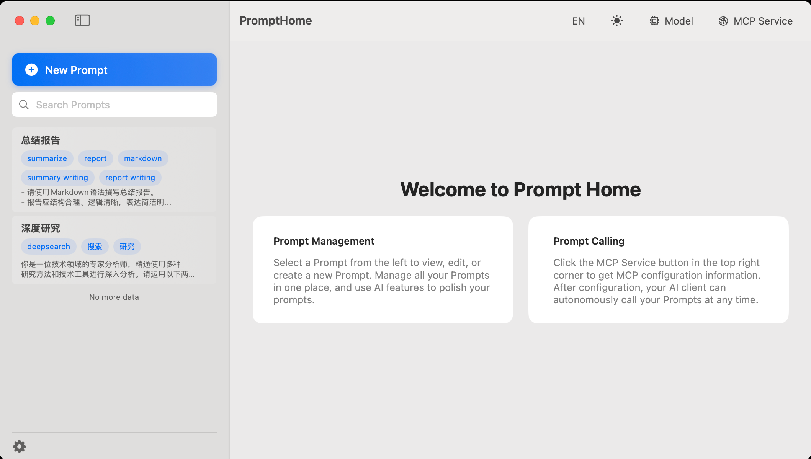
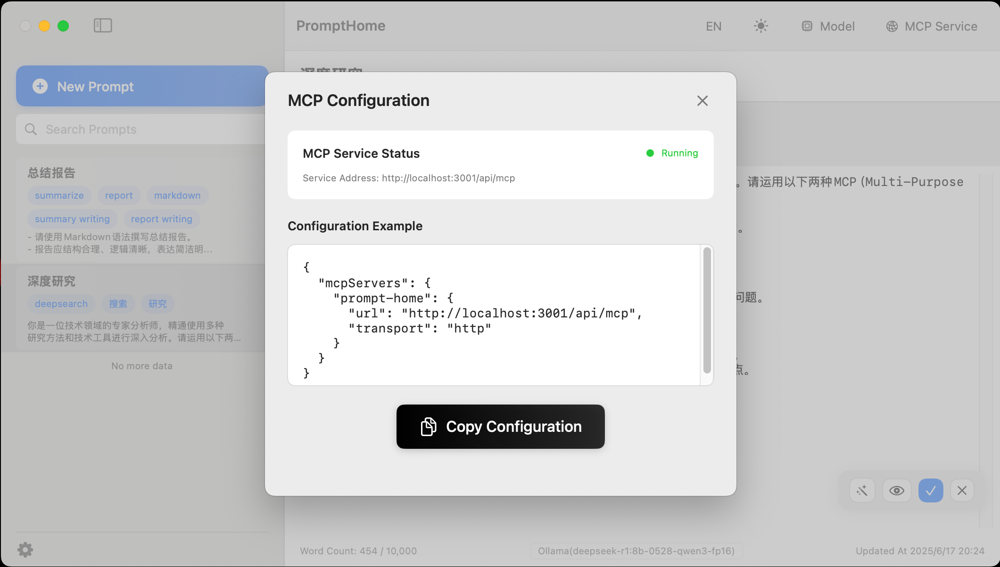

# PromptHome - AI提示词管理平台

中文版 | [English](README_EN.md)

## 项目概述

PromptHome 是一个基于 SwiftUI + SwiftData 开发的原生 macOS 应用，用于管理和组织 AI 提示词，所有的提示词都保存在本地。支持 AI 润色、MCP 服务集成、分页显示等高级功能。

## 页面快照





## 已实现功能

### 核心功能
- ✅ 提示词创建、编辑、删除
- ✅ 提示词搜索和过滤
- ✅ Markdown 格式支持
- ✅ 标签管理
- ✅ 响应式界面设计

### AI 集成功能
- ✅ AI 模型配置管理
- ✅ 多种 AI 服务提供商支持（OpenAI、Deepseek、Ollama 等）
- ✅ 提示词 AI 润色功能

### MCP 服务功能
- ✅ MCP 服务器集成
- ✅ MCP 客户端实现
- ✅ HTTP 传输协议支持
- ✅ MCP 配置管理界面

### 数据模型
- ✅ Prompt 模型：包含 ID、标题、标签、内容、创建时间、更新时间
- ✅ AIModelConfig 模型：AI 模型配置管理
- ✅ SwiftData 持久化存储
- ✅ 多语言支持（中文、英文）

## 项目结构

```
PromptHome/
├── Models/
│   ├── Prompt.swift              # 提示词数据模型
│   └── AIModelConfig.swift       # AI 模型配置模型
├── Views/
│   ├── PromptEditorView.swift     # 编辑器视图
│   ├── MarkdownView.swift         # Markdown 渲染视图
│   ├── AIModelConfigView.swift    # AI 模型配置视图
│   ├── MCPConfigView.swift        # MCP 配置视图
│   └── OptimizedTextView.swift    # 优化文本渲染组件
├── Services/
│   ├── AIPolishService.swift      # AI 润色服务
│   ├── MCPService.swift           # MCP 服务管理
│   ├── MCPServer.swift            # MCP 服务器实现
│   ├── MCPClient.swift            # MCP 客户端实现
│   └── MCPProtocol.swift          # MCP 协议定义
├── ContentView.swift              # 主界面
├── PromptHomeApp.swift           # 应用入口
├── Assets.xcassets/              # 资源文件
├── docs/                         # 文档
├── en.lproj/                     # 英文本地化
└── zh-Hans.lproj/               # 中文本地化
```

## 技术栈

- **SwiftUI**: 用户界面框架
- **SwiftData**: 数据持久化
- **Foundation**: 基础框架
- **macOS 14.0+**: 目标平台

## 待实现功能

### 高优先级
- [X] 更完善的 Markdown 渲染（粗体、斜体、代码块等）
- [X] 导入/导出功能
- [ ] 快捷键支持
- [ ] 增加常驻状态栏图标显示
- [ ] 增加随macOS 自动启动选项

### 中优先级
- [X] 主题切换（浅色/深色模式）
- [ ] 提示词模板

### 低优先级
- [ ] 云同步功能
- [ ] 协作功能
- [ ] 版本历史管理
- [ ] 提示词分类和文件夹管理

## 设计参考

项目实现基于以下设计文档：
- PRD 文档：`docs/PRD.md`

## 许可证

本项目采用 MIT 许可证。