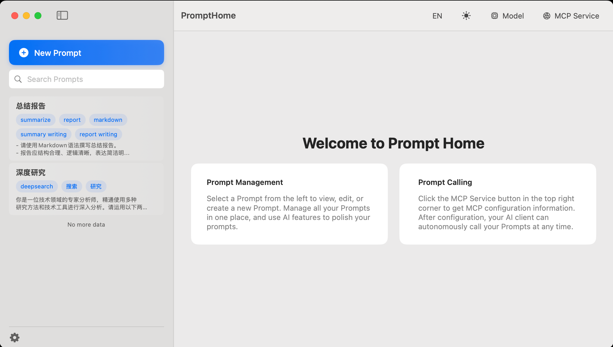
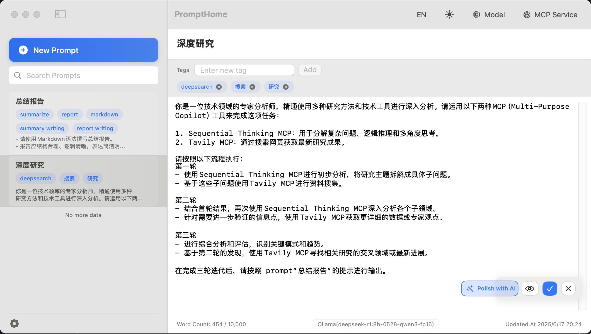
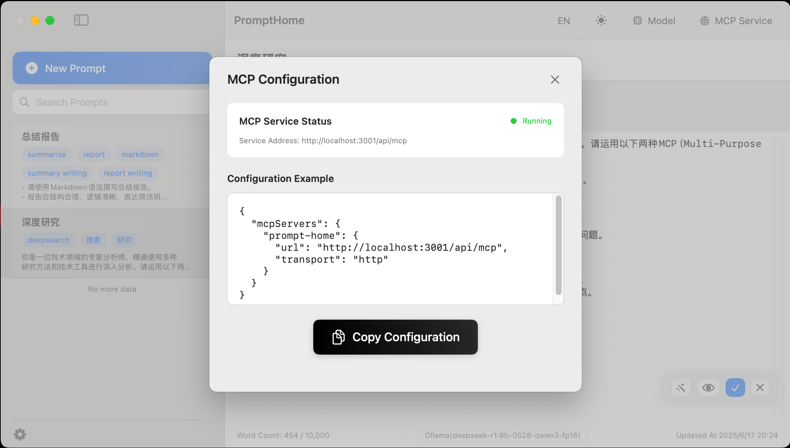
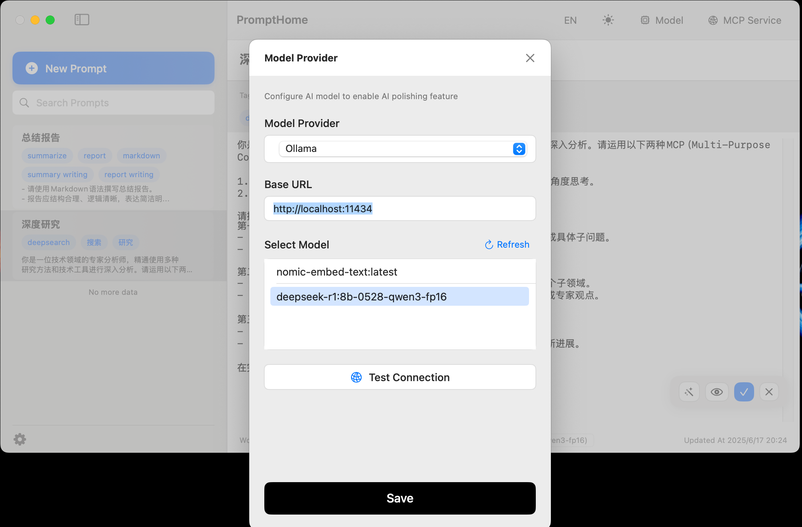

# PromptHome - AI Prompt Management Platform

[中文版](README.md) | English

## Project Overview

PromptHome is a native macOS application developed with SwiftUI + SwiftData for managing and organizing AI prompts. It supports advanced features such as AI polishing, MCP service integration, and pagination.

## Screenshots





## Implemented Features

### Core Features
- ✅ Prompt creation, editing, and deletion
- ✅ Prompt search and filtering
- ✅ Markdown format support
- ✅ Tag management
- ✅ Responsive interface design

### AI Integration Features
- ✅ AI model configuration management
- ✅ Multiple AI service provider support (OpenAI, Deepseek, Ollama, etc.)
- ✅ AI prompt polishing functionality

### MCP Service Features
- ✅ MCP server integration
- ✅ MCP client implementation
- ✅ HTTP transport protocol support
- ✅ MCP configuration management interface

### Data Models
- ✅ Prompt model: includes ID, title, tags, content, creation time, update time
- ✅ AIModelConfig model: AI model configuration management
- ✅ SwiftData persistent storage
- ✅ Multi-language support (Chinese, English)

## Project Structure

```
PromptHome/
├── Models/
│   ├── Prompt.swift              # Prompt data model
│   └── AIModelConfig.swift       # AI model configuration model
├── Views/
│   ├── PromptEditorView.swift     # Editor view
│   ├── MarkdownView.swift         # Markdown rendering view
│   ├── AIModelConfigView.swift    # AI model configuration view
│   ├── MCPConfigView.swift        # MCP configuration view
│   └── OptimizedTextView.swift    # Optimized text rendering component
├── Services/
│   ├── AIPolishService.swift      # AI polishing service
│   ├── MCPService.swift           # MCP service management
│   ├── MCPServer.swift            # MCP server implementation
│   ├── MCPClient.swift            # MCP client implementation
│   └── MCPProtocol.swift          # MCP protocol definition
├── ContentView.swift              # Main interface
├── PromptHomeApp.swift           # Application entry point
├── Assets.xcassets/              # Resource files
├── docs/                         # Documentation
├── en.lproj/                     # English localization
└── zh-Hans.lproj/               # Chinese localization
```

## Tech Stack

- **SwiftUI**: User interface framework
- **SwiftData**: Data persistence
- **Foundation**: Base framework
- **macOS 14.0+**: Target platform

## Upcoming Features

### High Priority
- [X] Enhanced Markdown rendering (bold, italic, code blocks, etc.)
- [X] Import/export functionality
- [ ] Prompt categorization and folder management
- [ ] Keyboard shortcuts support

### Medium Priority
- [X] Theme switching (light/dark mode)
- [ ] Prompt templates

### Low Priority
- [ ] Cloud synchronization
- [ ] Collaboration features
- [ ] Version history management

## Design Reference

Project implementation is based on the following design documents:
- PRD Document: `docs/PRD.md`

## License

This project is licensed under the MIT License.